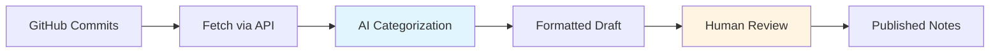

# Release Notes Automation Starter

## Overview

This project demonstrates how to automate release notes creation from GitHub commits using AI. It provides a working example and tutorial for technical writers exploring AI-assisted automation.

## What This Does

**The automation handles:**

- Fetching commits from GitHub API
- Filtering out internal/WIP changes
- Categorizing into Features, Enhancements, Bug Fixes, Documentation
- Formatting as Markdown with commit links
- Generating draft for human review

**You provide:**

- Your categorization standards
- Final review and context
- Decision to publish

## Quick Start

**Three steps to get started:**

1. **[Document your manual process](tutorial/step-2-document-process.md)** - Write down how you currently create release notes
2. **[Configure the tool](tutorial/step-3-configure.md)** - Add your API keys
3. **[Run and iterate](tutorial/step-4-run-first-time.md)** - Generate your first draft and refine the prompts

[Start the Tutorial](tutorial/index.md)

## Who This Is For

**This starter is designed for:**

- Technical writers working in docs-as-code environments
- Teams using GitHub, GitLab, or Bitbucket
- Anyone with basic Git knowledge and command line comfort
- Writers exploring AI-assisted automation

No programming experience is required.

## What You'll Learn

By working through this project, you'll learn:

1. **Process documentation** - How to document manual workflows before automating
2. **Prompt engineering** - How to teach AI your categorization standards
3. **Iterative refinement** - How to improve automation based on results
4. **API integration** - How scripts connect to version control systems
5. **Plan-before-code** - Why planning saves time over jumping straight to implementation

## Key Principles

This project demonstrates important automation principles:

### Document Your Process First

Before automating anything, write down your manual workflow. Your documented process becomes the foundation for your automation prompt.

### Plan Before Code

Ask AI to write a plan first, then implement. Plans are faster to iterate than code.

### Human-in-the-Loop

Automation generates drafts. Humans provide final review and context. This maintains quality while saving time.

### Iterate Based on Results

Your first prompt won't be perfect. Test, refine, and improve based on real outputs.

## What's Included

This repository contains:

- Working Python script that connects to GitHub API and generates release notes
- Sample prompts with categorization instructions for AI
- Prompt evolution examples showing iteration from simple to refined
- Configuration templates for API keys
- Sample data to test without API access initially
- Step-by-step tutorial with complete walkthrough
- Troubleshooting guide with solutions to common issues

## Next Steps

**New to this?**  
Start with the [Getting Started](getting-started.md) guide for prerequisites and installation.

**Ready to build?**  
Jump into the [Tutorial](tutorial/index.md) to build your first automation.

**Need help?**  
Check the [Troubleshooting](troubleshooting.md) guide or [FAQ](faq.md).

**Want details?**  
Explore the [Reference](reference/configuration.md) documentation.

## Contributing

If you'd like to contribute:

- Report issues or suggest improvements in the [GitHub repository](https://github.com/rebeja/docs-automation-examples/issues)
- Share examples or improvements via pull requests
- See [CONTRIBUTING.md](https://github.com/rebeja/docs-automation-examples/blob/main/CONTRIBUTING.md) for guidelines

---

[Get Started](getting-started.md)
