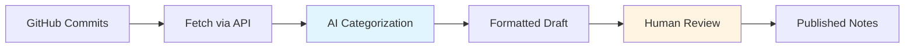

# Release Notes Automation Starter

## Welcome

Transform your release notes workflow from days of manual curation to minutes of automated draft generation. This starter project shows you how to use AI coding agents to automate release notes creation from GitHub commits—no programming experience required.

## What This Does

**The automation handles:**

- ✅ Fetching commits from GitHub API
- ✅ Filtering out internal/WIP changes
- ✅ Categorizing into Features, Enhancements, Bug Fixes, Documentation
- ✅ Formatting as Markdown with commit links
- ✅ Generating draft for human review

**You provide:**

- Your categorization standards
- Final review and context
- Decision to publish

## Time Savings

| Manual Process | With Automation |
|---------------|----------------|
| 4-8 hours per release | 15-30 minutes |
| Review 50+ commits | Review AI draft |
| Manual categorization | AI categorization |
| Inconsistent format | Consistent format |

## Quick Start

**Three steps to get started:**

1. **[Document your manual process](tutorial/step-2-document-process.md)** - Write down how you currently create release notes
2. **[Configure the tool](tutorial/step-3-configure.md)** - Add your API keys
3. **[Run and iterate](tutorial/step-4-run-first-time.md)** - Generate your first draft and refine the prompts

👉 **[Start the Tutorial →](tutorial/index.md)**

## Who This Is For

**This starter is designed for:**

- ✅ Technical writers working in docs-as-code environments
- ✅ Teams using GitHub, GitLab, or Bitbucket
- ✅ Anyone with basic Git knowledge and command line comfort
- ✅ Writers exploring AI-assisted automation
- ❌ No programming experience required!

## What You'll Learn

By working through this project, you'll learn:

1. **Process documentation** - How to document manual workflows before automating
2. **Prompt engineering** - How to teach AI your categorization standards
3. **Iterative refinement** - How to improve automation based on results
4. **API integration** - How scripts connect to version control systems
5. **Plan-before-code** - Why planning saves time over jumping straight to implementation

## Key Principles

This project demonstrates important automation principles:

!!! success "Document Your Process First"
    Before automating anything, write down your manual workflow. Your documented process becomes the foundation for your automation prompt.

!!! success "Plan Before Code"
    Ask AI to write a plan first, then implement. Plans are faster to iterate than code.

!!! success "Human-in-the-Loop"
    Automation generates drafts; humans provide final review and context. This maintains quality while saving time.

!!! success "Iterate Based on Results"
    Your first prompt won't be perfect. Test, refine, and improve based on real outputs.

## What's Included

This repository contains:

- **Working Python script** - Connects to GitHub API and generates release notes
- **Sample prompts** - Categorization instructions for AI
- **Prompt evolution examples** - Shows iteration from simple to refined
- **Configuration templates** - Easy setup for API keys
- **Sample data** - Test without API access initially
- **Step-by-step tutorial** - Complete walkthrough for beginners
- **Troubleshooting guide** - Solutions to common issues

## Next Steps

=== "New to This?"
    Start with the **[Getting Started](getting-started.md)** guide for prerequisites and installation.

=== "Ready to Build?"
    Jump into the **[Tutorial](tutorial/index.md)** to build your first automation.

=== "Need Help?"
    Check the **[Troubleshooting](troubleshooting.md)** guide or **[FAQ](faq.md)**.

=== "Want Details?"
    Explore the **[Reference](reference/configuration.md)** documentation.

## Support This Project

If this project helps you, please:

- ⭐ Star the [GitHub repository](https://github.com/rebeja/docs-automation-examples)
- 📝 Share your experience with the technical writing community
- 🐛 Report issues or suggest improvements
- 🤝 Contribute examples or improvements

---

**Ready to automate your release notes?** [Get Started →](getting-started.md){ .md-button .md-button--primary }
